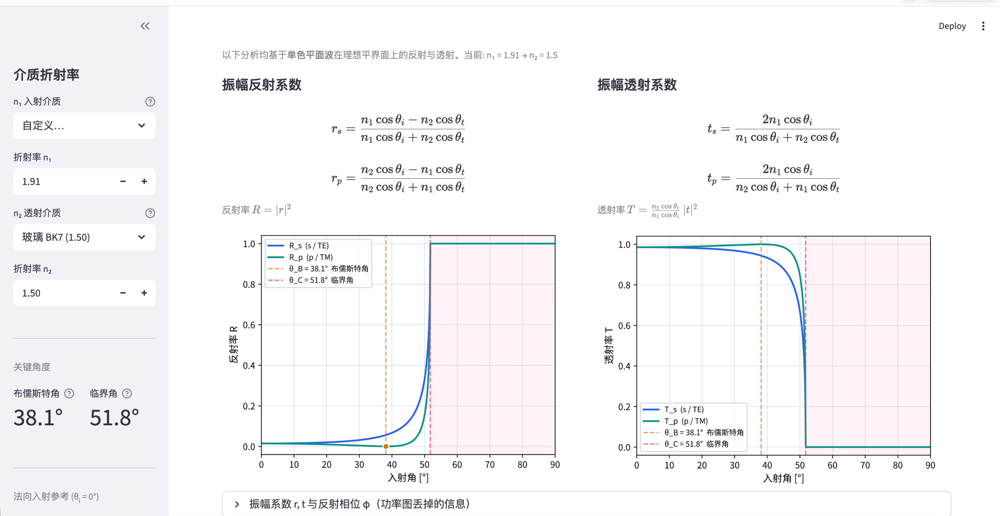

# Fresnel_Equation

一个交互式的**菲涅耳方程**教学 App（Streamlit 单文件）。它把光在介质界面上的反射/透射，从「看现象」到「推物理」串成一条清晰主线：调参数 → 看曲线 → 逐点验证 → 一键展开完整推导。

适合光学课程配套、自学复习，或作为理解**布儒斯特角、全内反射、倏逝波、古斯-汉欣位移**的可视化工具。



---

## ✨ 功能一览

### 1. 反射率 / 透射率曲线
- $R(\theta_i)$、$T(\theta_i)$ 随入射角的变化，s（TE）与 p（TM）两种偏振分色显示。
- 自动标注**布儒斯特角 $\theta_B$**（p 反射零点）与**临界角 $\theta_C$**（全内反射起始），并对全反射区着色。
- 侧边栏实时给出 $\theta_B$、$\theta_C$ 与法向入射参考值。

### 2. 振幅系数与反射相位（可折叠）
功率图 $R=|r|^2$ 丢掉了振幅系数的**符号与相位**，这里专门补回来：
- **带符号的振幅反射系数 $r_s,r_p$** —— 直观看到半波损失、$r_p$ 在布儒斯特角穿零变号。
- **振幅透射系数 $t_s,t_p$** —— 恒正、内反射时可 > 1。
- **反射相位 $\phi=\arg(r)$** —— 全反射后相位如何从 $0°$ 连续降到 $-180°$。

### 3. 逐点查看
拖动滑块选定任意入射角，实时显示：
- **光线示意图**：入射 / 反射 / 折射光与角度；全内反射时叠加倏逝波的**指数衰减场**、**穿透深度 $\delta$** 与**古斯-汉欣横向位移 $D$**。
- **功率系数** $R_s,R_p,T_s,T_p$ 与能量守恒校验 $R+T=1$。
- **复振幅系数 $r,t$**（可折叠）：含全反射区 $|r|=1$ 的复数值与相位。
- 全反射专属指标：**透射深度 $\delta$**、**相对相移 $\Delta\phi=\phi_p-\phi_s$**、**古斯-汉欣位移 $D_s,D_p$**（均以真空波长 $\lambda$ 为单位）。

### 4. 完整公式推导（📖 按钮）
一个对话框，从第一性原理一路推到底：
- 麦克斯韦方程 → 界面**切向连续边界条件** → 相位匹配得 **Snell 定律**；
- s / p 两种偏振分别联立边界条件 → **Fresnel 四式**；
- 坡印廷矢量 → 功率系数 $R,T$ 与能量守恒；
- **布儒斯特角** $\tan\theta_B=n_2/n_1$、**临界角** $\sin\theta_C=n_2/n_1$ 的推导；
- 色散关系 + 切向波矢守恒 → $k_z$ 变虚 → **倏逝波**与穿透深度；
- **古斯-汉欣位移**：从相位色散 $D=-\,d\phi/dk_x$ 给出 $D_s,D_p$ 闭式；
- 为什么 $\phi_p$ 比 $\phi_s$ 降得更快（s/p 边界约束的不对称根因）；
- GH 位移的**角谱分解 + 傅里叶位移定理**第一性原理证明（牛顿预见 → Goos & Hänchen 实测）。

### 5. 材料预设
内置 13 种常用材料折射率（空气、水、熔融石英、玻璃 BK7、蓝宝石、金刚石、碳化硅……），下拉选择或手动输入，两者双向联动。

---

## 🚀 运行

```bash
git clone https://github.com/Hongxin-Chen/fresnel-app.git
cd fresnel-app
pip install -r requirements.txt
python -m streamlit run app.py
```

启动后浏览器打开终端给出的本地地址（默认 http://localhost:8501 ）。

> 提示：所有计算都是向量化 NumPy，参数一改即时刷新，无需等待。

---

## 📦 依赖

| 库 | 用途 |
|---|---|
| `streamlit` | 交互界面 |
| `numpy` | 向量化 Fresnel / 倏逝波计算 |
| `matplotlib` | 曲线与光线示意图 |

详见 [`requirements.txt`](requirements.txt)。中文字体在首次运行时会自动下载 Noto Sans SC（失败则回退系统字体）。

---

## 📐 物理约定

- 界面取 $z=0$ 平面，介质 1（$n_1$，入射侧）在 $z>0$，介质 2（$n_2$，透射侧）在 $z<0$；
- 入射面取 $x\text{–}z$ 平面，s 偏振 $\mathbf E\parallel y$、p 偏振 $\mathbf H\parallel y$；
- 全反射时 $\cos\theta_t$ 取纯虚数，倏逝波沿 $+x$ 传播、沿 $z$ 指数衰减。

---

## 📄 许可

MIT License。欢迎用于教学与学习。
